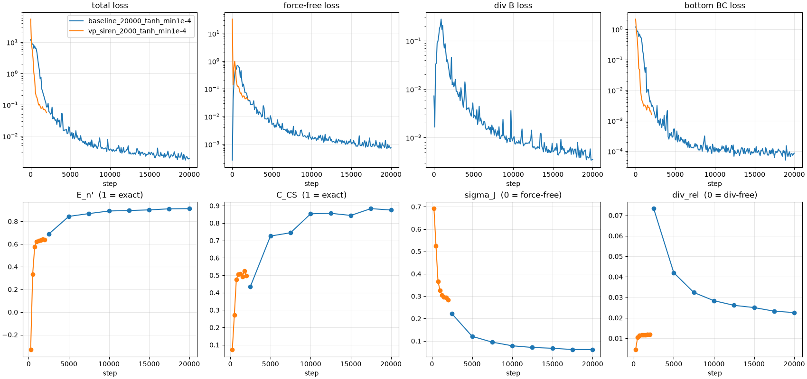

# 2026-10-05: ベースラインと、ベクトルポテンシャル + SIREN

## 目的

ベースラインと、ベクトルポテンシャル + SIREN を、同じ実行時間で比べる。

## やったこと

- 実験
  - `results/2026-10-05_baseline`: ベースライン
  - `results/2026-10-05_vp_siren`: ベースラインからの変更は、ベクトルポテンシャルと SIREN の 2 つ
- 実行環境: RTX 3090 1 枚
- 1 ステップの計算時間がベースラインの約 10 倍なので、ステップ数を 10 倍変えて実行時間をそろえた

### ベースライン

1. **無次元化**: 長さは水平方向の領域の大きさ、磁場は下端の |B| の RMS で割る。
2. **境界条件は下端だけ**: 側面と上端には何も課さない。
3. **損失**（どの項も B について 2 次）:
   - フォースフリー: |J×B|² / |B|²
   - div B: (∇·B)²
   - 下端境界: |B − B_obs|²（重み 10）
4. **内部の点は下端付近に多く取る**: 下端と上端の密度比は 10:1。
5. **学習率**: 1e-3 から 1e-4 へ、tanh 型に下げる（中間になるのは 5000 ステップ）。
6. **ネットワーク**: 全結合 5 層 × 128、活性化関数 tanh。

### ベクトルポテンシャル + SIREN

- **ベクトルポテンシャル**: ネットワークが A を出力し、B = ∇×A とする。div B = 0 が厳密に成り立つので、div B の損失はない。1 ステップの計算時間は約 10 倍、GPU メモリは約 20 GB。
- **SIREN**: 活性化関数を sin(3 ·) にする（ω0 = 30 は学習率 1e-3 では不安定で学習できなかった）。
- 学習率は、ステップ数に合わせて 10 倍速く下げる（中間になるのは 500 ステップ）。

## 結果

| 実験 | ステップ数 | 実行時間 | E_n' | C_CS | sigma_J | div_rel |
| --- | --- | --- | --- | --- | --- | --- |
| ベースライン | 10000 | 378 秒 | 0.892 | 0.853 | 0.078 | 0.028 |
| ベースライン | 20000 | 745 秒 | 0.913 | 0.875 | 0.061 | 0.023 |
| ベクトルポテンシャル + SIREN | 1000 | 412 秒 | 0.621 | 0.505 | 0.326 | 0.012 |
| ベクトルポテンシャル + SIREN | 2000 | 809 秒 | 0.639 | 0.497 | 0.283 | 0.012 |

実行中は GPU を他のジョブと共有していたため、実行時間は GPU を占有したときの約 1.4 倍になっている（どちらの実験も同じように遅くなっている）。

## わかったこと

- **同じ実行時間では、ベースラインの方がよい**。ベクトルポテンシャルは div B = 0 を厳密に満たす（div_rel が厳密解と同じ 0.012）が、この時間では磁場がまだ合っていない（下端の誤差も 0.1 程度残る）。
- 評価値は、学習とともにほぼ単調によくなる。
- ステップ数を 2 倍にすると、どちらも改善する（ベースライン E_n' 0.892 → 0.913、ベクトルポテンシャル + SIREN 0.621 → 0.639）。

## 次にやること

- ベクトルポテンシャルの計算を軽くする工夫（同じ時間でのステップ数を増やす）。
- 学習率の下げ方（LR_T_HALF, LR_T_WIDTH）と、ステップ数の関係を調べる。
